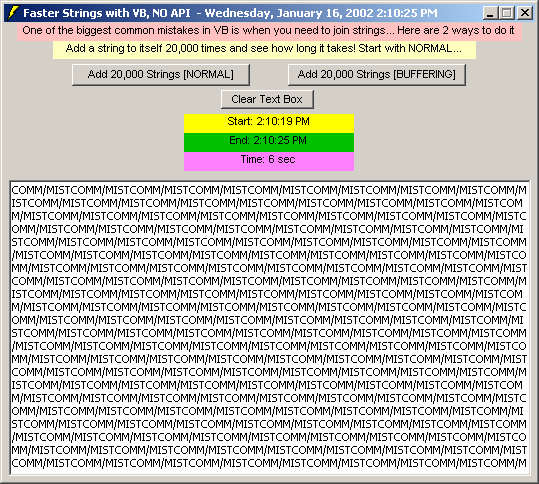



## Biggest common "mistake" in VB \- update Jan 16

### Description

This is just an update to the nice piece of code submitted by VF-fCRO on 1/12/2002. I simply added some small features (elapsed time, a different way to loop, minor text edits, etc). Doesn't really change the purpose of the original, just adds a few touches to it. the original is at

http://www.planetsourcecode.com/vb/scripts/ShowCode.asp?txtCodeId=30734&lngWId=1

I wouldn't really entitle VF-fCRO's submission a "mistake"; he/she actually submitted a demonstration of a better way to handle concatenating strings with a far faster technique, and it doesn't use and API calls or weird, esoteric methods.
 
### More Info
 
Faster way to handle string concatenation than what many people might consider the "default" technique. Can make a big difference, and might give you other ideas for optimizing your code.

             |
---                |---
**Submitted On**   |2002-01-16 12:39:52
**By**             |[Brian Battles WS1O](https://github.com/Planet-Source-Code/PSCIndex/blob/master/ByAuthor/brian-battles-ws1o.md)
**Level**          |Beginner
**User Rating**    |4.7 (33 globes from 7 users)
**Compatibility**  |VB 3\.0, VB 4\.0 \(16\-bit\), VB 4\.0 \(32\-bit\), VB 5\.0, VB 6\.0
**Category**       |[String Manipulation](https://github.com/Planet-Source-Code/PSCIndex/blob/master/ByCategory/string-manipulation__1-5.md)
**World**          |[Visual Basic](https://github.com/Planet-Source-Code/PSCIndex/blob/master/ByWorld/visual-basic.md)
**Archive File**   |[Biggest\_co491081162002\.zip](https://github.com/Planet-Source-Code/brian-battles-ws1o-biggest-common-mistake-in-vb-update-jan-16__1-30860/archive/master.zip)

